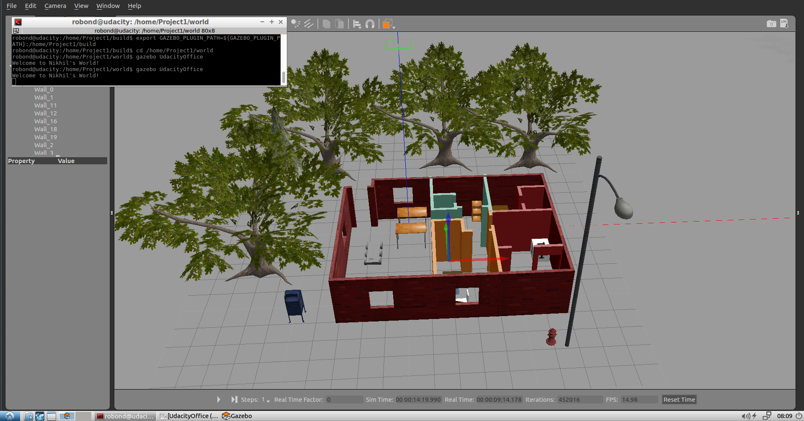

# Robotics-Software-Engineer



## Build Instructions
1. Make sure you have the following installed:
   - [ROS](http://wiki.ros.org/ROS/Installation)
   - [Cmake](https://cmake.org/)
   - [Git](https://git-scm.com/)
2. Clone the project
3. Go to the project folder
4. Create a build folder `mkdir build && cd build`
5. Build with cmake `cmake .. && make`
6. Add the build folder to the Gazebo plugin path: 
`GAZEBO_PLUGIN_PATH=${GAZEBO_PLUGIN_PATH}:<path_to_build_folder>`. For example,
`GAZEBO_PLUGIN_PATH=${GAZEBO_PLUGIN_PATH}:/home/Project1/build
7. Go back to the project folder
8. Launch Gazebo world `gazebo world/UdacityOffice`

## Structure
```
.Project1             # Build My World Project 
├── model                          # Model files 
│   ├── Building
│   │   ├── model.config
│   │   ├── model.sdf
│   ├── HumanoidRobot
│   │   ├── model.config
│   │   ├── model.sdf  
├── script                          
│   ├── welcome_message.cpp         # Plugin files
├── world                         
│   ├── UdacityOffice.world         # World files
├── CMakeLists.txt
└──   
```
